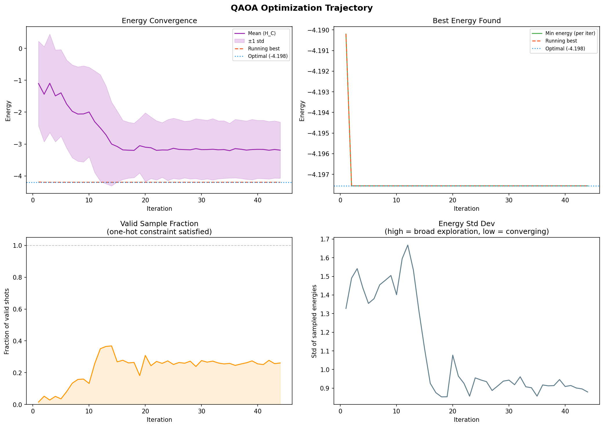

# Quantum Pricing Optimization with QAOA

 **Applying quantum computing to a real industrial problem — optimizing product pricing using a variational quantum algorithm, benchmarked rigorously against classical solvers.**

## What this project does

This project models a simplified **automotive pricing problem** by assigning the best price to each product to maximize revenue and solves it using a **quantum algorithm running on a simulated quantum computer**.

The same problem is also solved using two classical methods, so the quantum approach can be directly compared on solution quality, accuracy, and runtime.

---

## Why this problem?

Pricing optimization is hard. With many products, each having multiple possible price levels, and demand for each product depending on the others, the number of possible combinations grows exponentially. This makes it a natural candidate for quantum optimization methods.

This is also directly relevant to emerging industrial quantum computing research — including approaches like **Decoded Quantum Interferometry (DQI)**, which targets exactly this class of combinatorial problem.

---

## How it works 

**Step 1 — Encode the problem**
The pricing problem is translated into a mathematical format called a **QUBO** (Quadratic Unconstrained Binary Optimization) — a standard input format for quantum optimization hardware.

**Step 2 — Translate to quantum**
The QUBO is converted into a **quantum Hamiltonian** — an operator whose lowest-energy state corresponds to the optimal price assignment.

**Step 3 — Run the quantum algorithm (QAOA)**
A quantum circuit is run repeatedly, each time measuring a candidate solution. A classical optimizer tunes the circuit's parameters to make good solutions appear more frequently — like tuning an antenna to pick up the right signal.

**Step 4 — Benchmark**
The quantum result is compared against an exact solver (brute force) and a classical heuristic (simulated annealing) on revenue quality, approximation ratio, and runtime.

---

## Convergence tracking

The quantum optimizer is tracked in real time across all iterations:

  

- **Energy convergence** — does the optimizer improve over time?
- **Best solution found** — does the circuit ever sample the optimal answer?
- **Valid solution rate** — what fraction of quantum measurements satisfy the problem constraints?
- **Exploration vs convergence** — is the circuit searching broadly or concentrating on good solutions?

